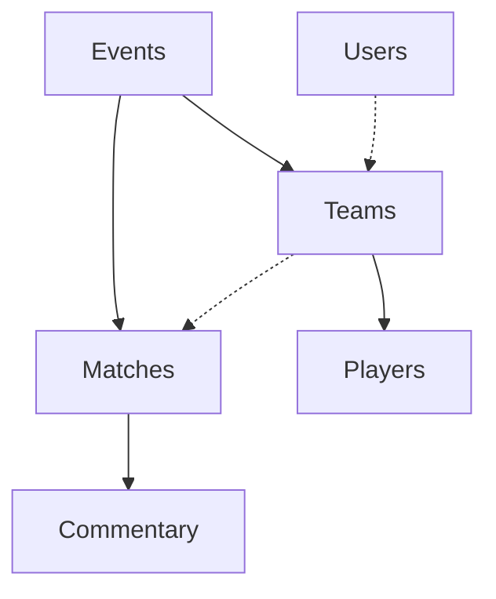

# Khelset Firebase Data Structure Documentation

## Overview
Khelset uses a **normalized data structure** with separate collections for optimal performance, scalability, and cross-platform compatibility (Flutter mobile app + React admin app).

## 🏗️ **Database Architecture**

### **Core Collections**
```
📁 Firestore Database
├── 📂 users/           # User authentication & profiles
├── 📂 events/          # Cricket tournaments/competitions  
├── 📂 teams/           # Team information with player references
├── 📂 players/         # Individual player profiles
├── 📂 matches/         # Match details & results
└── 📂 commentary/      # Live match commentary
```

---

## 📊 **Detailed Collection Schemas**

### **1. Users Collection** 
**Path:** `/users/{userId}`

```javascript
{
  "uid": "auth_user_id",           // Firebase Auth UID
  "email": "user@example.com",     // User email
  "displayName": "John Doe",       // User display name
  "role": "user",                  // "user" | "admin"
  "createdAt": Timestamp,          // Account creation time
  "lastLoginAt": Timestamp         // Last login time
}
```

**Access Patterns:**
- ✅ Users can read/write their own document
- ✅ Admins can read all user documents

---

### **2. Events Collection**
**Path:** `/events/{eventId}`

```javascript
{
  "name": "IPL 2024",              // Event name
  "description": "Premier League", // Event description
  "startDate": Timestamp,          // Event start date
  "endDate": Timestamp,            // Event end date
  "location": "Mumbai, India",     // Event location
  "status": "active",              // "upcoming" | "active" | "completed"
  "rules": {                       // Match rules & settings
    "playersPerTeam": 11,          // Number of players per team
    "oversPerInnings": 20,         // Overs per innings
    "matchType": "T20"             // Match format
  },
  "createdBy": "admin_user_id",    // Event creator
  "createdAt": Timestamp           // Creation time
}
```

**Access Patterns:**
- ✅ Anyone can read events
- ✅ Only admins can create/update/delete events

---

### **3. Teams Collection** ⭐
**Path:** `/teams/{teamId}`

```javascript
{
  "name": "Mumbai Indians",        // Team name
  "eventId": "event_123",          // Reference to parent event
  "captainId": "user_456",         // Team captain's user ID
  "status": "approved",            // "pending" | "approved" | "rejected"
  "playerIds": [                   // 🔑 CRITICAL: Array of player IDs
    "player_001",
    "player_002", 
    "player_003"
    // ... up to 11 players
  ],
  "createdAt": Timestamp,          // Team creation time
  "approvedAt": Timestamp,         // Admin approval time
  "approvedBy": "admin_user_id"    // Approving admin
}
```

**🔑 Key Design Decision:**
- Uses `playerIds` array instead of embedded player objects
- Enables efficient queries and React app compatibility
- Follows Firebase best practices for data normalization

---

### **4. Players Collection** ⭐
**Path:** `/players/{playerId}`

```javascript
{
  "name": "Virat Kohli",           // Player name
  "role": "Batsman",               // Player role/position
  "teamId": "team_789",            // Reference to parent team
  "eventId": "event_123",          // Reference to parent event
  "jerseyNumber": 18,              // Player's jersey number (optional)
  "createdAt": Timestamp           // Player creation time
}
```

**Relationships:**
- **One-to-Many:** Team → Players (via `teamId`)
- **Many-to-One:** Player → Team (via `playerIds` array)

---

### **5. Matches Collection**
**Path:** `/matches/{matchId}`

```javascript
{
  "eventId": "event_123",          // Parent event reference
  "team1Id": "team_456",           // First team ID
  "team2Id": "team_789",           // Second team ID
  "team1Name": "Mumbai Indians",   // Team 1 name (denormalized)
  "team2Name": "Chennai Super Kings", // Team 2 name (denormalized)
  "status": "completed",           // "scheduled" | "live" | "completed"
  "scheduledAt": Timestamp,        // Match scheduled time
  "startedAt": Timestamp,          // Actual start time
  "completedAt": Timestamp,        // Match completion time
  
  // Match Rules (copied from event)
  "rules": {
    "playersPerTeam": 11,
    "oversPerInnings": 20,
    "matchType": "T20"
  },
  
  // Innings Data
  "innings1": {
    "battingTeamId": "team_456",
    "battingTeamName": "Mumbai Indians",
    "bowlingTeamId": "team_789", 
    "bowlingTeamName": "Chennai Super Kings",
    "score": 185,
    "wickets": 6,
    "overs": 20.0,
    "battingStats": [             // Individual player stats
      {
        "playerId": "player_001",
        "name": "Virat Kohli",
        "runs": 82,
        "balls": 53,
        "fours": 8,
        "sixes": 2,
        "status": "not out"       // "out" | "not out"
      }
    ],
    "bowlingStats": [
      {
        "playerId": "player_011", 
        "name": "Jasprit Bumrah",
        "overs": 4.0,
        "runs": 32,
        "wickets": 2,
        "economy": 8.0
      }
    ]
  },
  
  "innings2": {
    // Similar structure to innings1
  },
  
  // Match Result
  "result": {
    "winnerTeamId": "team_456",
    "winnerTeamName": "Mumbai Indians", 
    "winType": "runs",               // "runs" | "wickets" 
    "winMargin": 15,                 // 15 runs or 5 wickets
    "resultText": "Mumbai Indians won by 15 runs"
  },
  
  // Awards
  "awards": {
    "manOfTheMatch": "player_001",
    "bestBatsman": "player_001",
    "bestBowler": "player_011"
  }
}
```

---

### **6. Commentary Collection**
**Path:** `/commentary/{commentaryId}`

```javascript
{
  "matchId": "match_123",          // Parent match reference
  "innings": 1,                    // Innings number (1 or 2)
  "over": 15,                      // Over number
  "ball": 3,                       // Ball number (1-6)
  "timestamp": Timestamp,          // Commentary time
  "text": "SIX! Kohli launches it over long-on!",
  "runs": 6,                       // Runs scored on this ball
  "isWicket": false,               // Whether it's a wicket ball
  "batsmanId": "player_001",       // Batsman on strike
  "bowlerId": "player_011",        // Bowler
  "createdAt": Timestamp
}
```

---

## 🔗 **Data Relationships**

### **Primary Relationships**


### **Key Foreign Keys**
- `teams.eventId` → `events.id`
- `teams.captainId` → `users.uid`
- `players.teamId` → `teams.id`
- `players.eventId` → `events.id`
- `matches.eventId` → `events.id`
- `matches.team1Id` → `teams.id`
- `matches.team2Id` → `teams.id`
- `commentary.matchId` → `matches.id`

---

## ⚡ **Performance Optimizations**

### **1. Denormalization Strategy**
```javascript
// ✅ GOOD: Store team names in matches for quick display
"team1Name": "Mumbai Indians",    // Denormalized for performance
"team1Id": "team_456"            // Normalized reference
```

### **2. Efficient Queries**
```javascript
// Get all teams for an event
teams.where('eventId', '==', eventId)

// Get all players for a team  
players.where('teamId', '==', teamId)

// Get all matches for an event
matches.where('eventId', '==', eventId)
```

### **3. Index Strategy**
```javascript
// Composite indexes for common queries
{
  "collectionGroup": "players",
  "fields": [
    {"fieldPath": "teamId", "order": "ASCENDING"},
    {"fieldPath": "createdAt", "order": "DESCENDING"}
  ]
}
```

---

## 🔒 **Security Rules Summary**

### **Permission Matrix**
| Collection | Read | Create | Update | Delete |
|------------|------|--------|---------|---------|
| **events** | All | Admin | Admin | Admin |
| **teams** | All | Captain | Captain/Admin | Admin |
| **players** | All | Captain | Captain/Admin | Captain/Admin |
| **matches** | All | Admin | Admin | Admin |
| **commentary** | All | Admin | Admin | Admin |
| **users** | Self/Admin | Self | Self | Self |

### **Key Security Features**
- ✅ Team captains can only manage their own teams/players
- ✅ Admins have full access to all collections
- ✅ All write operations require authentication
- ✅ Public read access for app functionality

---

## 🚀 **Team Registration Workflow**

### **Optimized Registration Process**
```javascript
// 1. Create team document with empty playerIds
const team = await teams.add({
  name: teamName,
  eventId: eventId,
  captainId: userId,
  playerIds: [],        // Start empty
  status: 'pending'
});

// 2. Create individual player documents
const playerIds = [];
for (const player of players) {
  const playerDoc = await players.add({
    name: player.name,
    role: player.role,
    teamId: team.id,     // Link to team
    eventId: eventId
  });
  playerIds.push(playerDoc.id);
}

// 3. 🔑 CRITICAL: Update team with actual player IDs
await team.update({
  playerIds: playerIds  // Populate with real IDs
});
```

**Why This Approach?**
- ✅ **React Compatibility:** React app can easily find players using `playerIds` array
- ✅ **Performance:** Avoids large embedded documents
- ✅ **Scalability:** Each player is a separate queryable document
- ✅ **Flexibility:** Easy to add/remove players without affecting team document

---

## 🌐 **Web vs Mobile Differences**

### **Common Web Issues & Solutions**

#### **1. Firestore Permission Errors**
```javascript
// Error: [cloud_firestore/permission-denied] Missing or insufficient permissions
```
**Solution:** Updated security rules to ensure web compatibility:
- ✅ Public read access to `events`, `teams`, `players`, `matches`
- ✅ Authenticated write access for team registration
- ✅ Cross-platform compatibility

#### **2. Font Manifest Missing**
```
Font manifest does not exist at `assets/FontManifest.json`
```
**Solution:** Created `web/assets/FontManifest.json` with Material Icons configuration

#### **3. Cache Issues**
Web apps may show outdated data due to browser caching.
**Solutions:**
- Hard refresh: `Ctrl+Shift+R` (Windows) or `Cmd+Shift+R` (Mac)
- Clear browser cache and storage
- Force server fetch in Firestore queries

#### **4. Asset Loading Issues**
Web builds handle assets differently than mobile.
**Solutions:**
- Ensure assets are properly configured in `pubspec.yaml`
- Run `flutter clean` and `flutter build web --release`
- Check `build/web` directory for proper asset deployment

### **Testing Checklist for Web**
- ✅ Authentication works correctly
- ✅ Firestore read/write operations succeed
- ✅ Team registration functions properly
- ✅ Images and icons load correctly
- ✅ Real-time updates work
- ✅ No console errors

---

## 📱 **Cross-Platform Compatibility**

### **Flutter Mobile App**
```dart
// Query team players efficiently
final players = await FirebaseFirestore.instance
    .collection('players')
    .where('teamId', isEqualTo: teamId)
    .get();
```

### **React Admin App**
```javascript
// Access players using playerIds array
const team = await db.collection('teams').doc(teamId).get();
const playerPromises = team.data().playerIds.map(id => 
  db.collection('players').doc(id).get()
);
const players = await Promise.all(playerPromises);
```

---

## 🔄 **Migration Notes**

### **Previous Structure Issues**
```javascript
// ❌ OLD: Embedded players (caused React compatibility issues)
{
  "name": "Team A",
  "players": [           // Embedded objects
    {"name": "Player 1", "role": "Batsman"},
    {"name": "Player 2", "role": "Bowler"}
  ]
}

// ✅ NEW: Normalized structure (current implementation)
{
  "name": "Team A", 
  "playerIds": ["player_001", "player_002"]  // References
}
```

### **Migration Strategy**
- **New teams:** Use optimized structure from day one
- **Existing teams:** Can be migrated using data migration tools (if needed)
- **Cleanup:** Remove any empty `playerIds` arrays that cause React issues

---

## 🛠️ **Development Best Practices**

### **1. Data Validation**
```javascript
// Always validate required fields
const team = {
  name: validateString(teamName),
  eventId: validateEventExists(eventId),
  captainId: validateUser(userId),
  playerIds: validatePlayerArray(playerIds)
};
```

### **2. Error Handling**
```javascript
try {
  // Database operations
} catch (error) {
  if (error.code === 'permission-denied') {
    // Handle permission errors
  } else if (error.code === 'not-found') {
    // Handle missing documents
  }
}
```

### **3. Real-time Updates**
```javascript
// Listen to real-time changes
const unsubscribe = db.collection('matches')
    .doc(matchId)
    .onSnapshot(doc => {
      // Update UI with latest match data
    });
```

---

## 📈 **Scaling Considerations**

### **Current Limits & Solutions**
- **Document Size:** Max 1MB (solved by normalized structure)
- **Array Fields:** Max 20K elements (playerIds arrays are small)
- **Queries:** Optimized with proper indexing
- **Real-time:** Efficient listeners for live match updates

### **Future Enhancements**
- Add more player statistics fields
- Implement team photo uploads (Firebase Storage)
- Add push notifications for match updates
- Extend awards system with more categories

---

## 📝 **Summary**

The Khelset Firebase data structure is designed for:
- ⚡ **Performance:** Fast queries with proper indexing
- 🔄 **Scalability:** Normalized structure prevents document size issues  
- 🔒 **Security:** Role-based permissions with proper validation
- 📱 **Cross-Platform:** Works seamlessly with Flutter & React
- 🚀 **Maintainability:** Clean separation of concerns

This structure provides a solid foundation for cricket match management with room for future enhancements.
